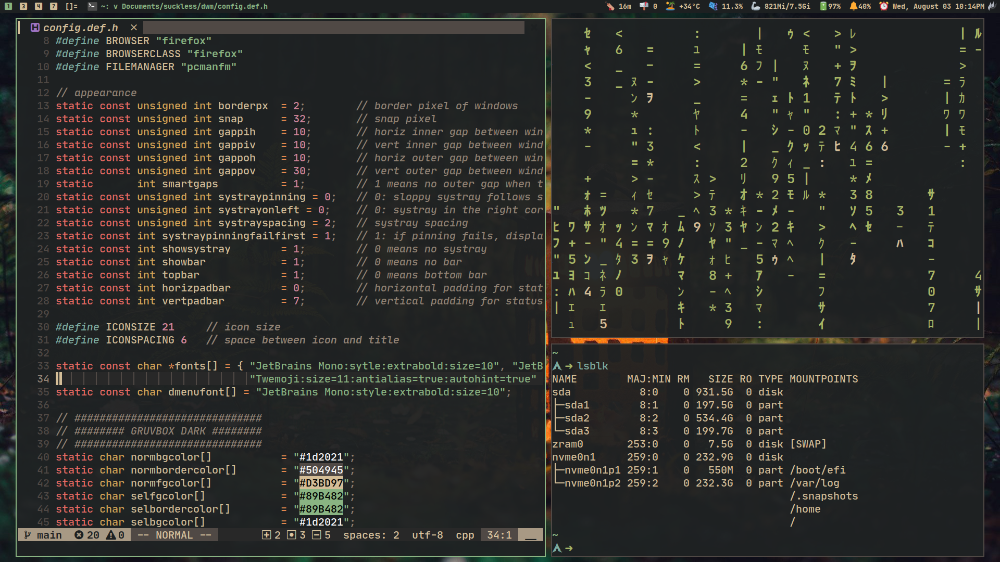
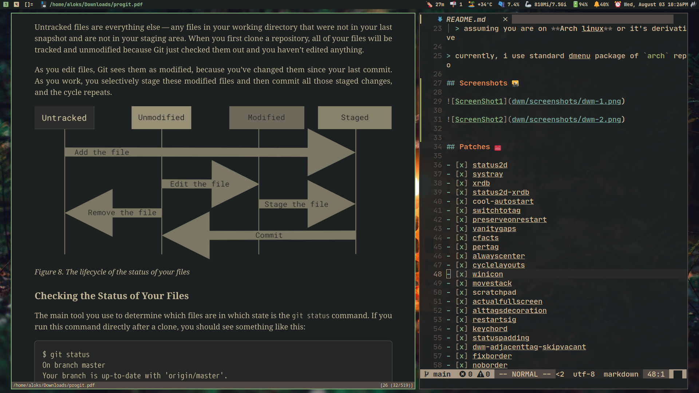

# My Personal DWM build 🌟

## About dwm 🐧

dwm is an extremely fast, small and dynamic window manager for X.

## Requirements ✏️

- `script` will grab dependencies (assuming you run `Arch Linux` or it's derivatives) and make, install suckless utilities.
- In order to build dwm you need the _Xlib header files_.
- ~~[**_libxft-bgra_**](https://aur.archlinux.org/packages/libxft-bgra-git) for coloured emojis in suckless utilities.~~
  - ~~comment `iscol` in **drw.c**~~

## Installation 🎙️

```sh
git clone https://github.com/alokshandilya/suckless.git
cd suckless
./install.sh
```

- `git clone` this repo and run `install.sh` ...
  > assuming you are on **Arch linux** or it's derivative

> currently, i use standard dmenu package of `arch` repo

## Screenshots 🌇






## Patches 🧰

- [x] status2d
- [x] systray
- [x] xrdb
- [x] status2d-xrdb
- [x] cool-autostart
- [x] switchtotag
- [x] preserveonrestart
- [x] vanitygaps
- [x] cfacts
- [x] pertag
- [x] alwayscenter
- [x] cyclelayouts
- [x] winicon
- [x] movestack
- [x] scratchpad
- [x] actualfullscreen
- [x] alttagsdecoration
- [x] restartsig
- [x] keychord
- [x] statuspadding
- [x] dwm-adjacenttag-skipvacant
- [x] fixborder
- [x] noborder
- [x] hidevacanttag
- **_maybe a few more ..._**
